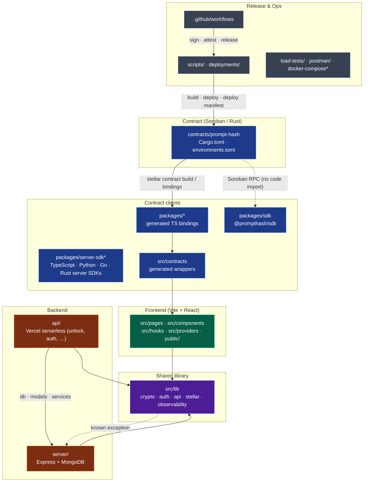

# Monorepo Map & Ownership Boundaries

This repository holds four runtimes: a Soroban contract, a browser app, Vercel serverless functions, and an optional Express server. It also holds the tooling that builds, signs, and deploys them. This page shows the owner of each directory, which directories may import from which, and the CI workflow that gates each area.

The boundary rules are enforced by `src/test/docs/monorepoBoundaries.test.ts` (`yarn test:frontend`). A PR that adds a new top-level directory or a new cross-boundary import fails that test until this page is updated.

## Diagram

Solid arrows are code imports or build outputs, and point from the consumer toward the provider. Dotted arrows are runtime-only links or tracked exceptions.

## Ownership

"Area" is a review group, not a GitHub handle. Changes inside an area need a review from someone who knows that area. A change that crosses areas, such as a contract ABI change that ripples into `src/contracts`, needs a review from each area it touches (see [CONTRIBUTING.md](../CONTRIBUTING.md): keep PRs focused).

<!-- ownership:start -->

| Path                | Area             | Owns                                                                                                      | CI gate                                                                         |
| ------------------- | ---------------- | --------------------------------------------------------------------------------------------------------- | ------------------------------------------------------------------------------- |
| `contracts/`        | Contract         | Listing, purchase, fee routing, access rights. No off-chain dependencies                                  | `contracts.yml`, `contract-gas-benchmarks.yml`, `soroban-schema-validation.yml` |
| `Cargo.toml`        | Contract         | Rust workspace, release profile                                                                           | `contracts.yml`                                                                 |
| `environments.toml` | Contract         | Scaffold networks and constructor args                                                                    | `contracts.yml`                                                                 |
| `packages/`         | Contract clients | Generated bindings (`packages/*`, git-ignored), the browser `packages/sdk`, and the server SDKs in `packages/server-sdk`, `packages/server-sdk-python`, `packages/server-sdk-go`, `packages/server-sdk-rust` | `ci.yml` (`packages/server-sdk` tests run under `yarn test:frontend`); Python/Go/Rust SDKs have package-local test suites |
| `src/contracts/`    | Contract clients | Generated wrappers that the frontend imports. Regenerate, don't hand-edit                                 | `frontend.yml`                                                                  |
| `src/`              | Frontend         | Pages, components, hooks, providers, i18n                                                                 | `frontend.yml`, `performance-budgets.yml`                                       |
| `public/`           | Frontend         | Static assets, PWA manifest                                                                               | `frontend.yml`                                                                  |
| `src/lib/`          | Shared library   | Crypto, auth, API schemas, Stellar client, observability. Imported by the frontend, `api/`, and `server/` | `frontend.yml`                                                                  |
| `api/`              | Backend          | Vercel serverless endpoints: challenge, unlock, reviews, moderation                                       | `ci.yml` (`yarn test:frontend` includes `api/**/*.test.ts`)                     |
| `server/`           | Backend          | Express server, MongoDB models, migrations, backups                                                       | `backend.yml`                                                                   |
| `postman/`          | Backend          | API collections                                                                                           | none                                                                            |
| `.github/`          | Release & Ops    | CI, deploy, signing, provenance, rollback                                                                 | `ci.yml` (provenance badge test), `hygiene.yml`                                 |
| `scripts/`          | Release & Ops    | Deploy, upgrade (with `--dry-run`), chain-status, creator-catalog-export, bootstrap, deploy manifest, security tooling | `ci.yml` (script unit tests)                                                    |
| `deployments/`      | Release & Ops    | Committed deploy manifests (hashes and addresses)                                                         | `ci.yml` (schema-validates every `*.json`)                                      |
| `load-tests/`       | Release & Ops    | k6 load and soak tests                                                                                    | none                                                                            |
| `docs/`             | Docs             | Architecture, operations, security, onboarding                                                            | `ci.yml` (doc tests), `hygiene.yml`                                             |

<!-- ownership:end -->

Top-level config files follow the directory they configure: `vite.config.ts` and `tailwind.config.js` belong to Frontend, `vercel.json` to Backend, and `docker-compose*.yml` to Release & Ops.

## Boundary Rules

Each rule is checked by the boundary test. Test files (`*.test.ts[x]`, `src/test/**`, `src/stories/**`) are exempt, because tests may reach across boundaries to exercise real handlers.

| #   | Rule                                                                                 | Why                                                                                                          |
| --- | ------------------------------------------------------------------------------------ | ------------------------------------------------------------------------------------------------------------ |
| 1   | Frontend UI code (`src/` outside `src/lib`) must not import from `api/` or `server/` | Server-only code and secrets must never be bundled into the browser                                          |
| 2   | `src/lib` must not import from `api/`                                                | The shared library sits below the endpoints that consume it                                                  |
| 3   | `src/lib` must not import from `server/`                                             | Same reason. The one existing violation is tracked below                                                     |
| 4   | `server/` must not import from `api/` or from frontend UI code                       | The Express server has to run without Vercel or React                                                        |
| 5   | `api/` may import only from `src/lib` and `server/src`, never from UI code           | Endpoints must not pull React or page code into serverless bundles                                           |
| 6   | `packages/sdk` must not import from `src/`, `api/`, or `server/`                     | It is published on its own as `@prompthash/sdk`                                                              |
| 7   | `contracts/` must not use Cargo `path` dependencies outside `contracts/`             | Contract builds stay hermetic and reproducible, and match the [deploy manifest](./deploy-manifest.md) hashes |

### Tracked exceptions

<!-- exceptions:start -->

| File                              | Imports                          | Rule | Plan                                                                                                                          |
| --------------------------------- | -------------------------------- | ---- | ----------------------------------------------------------------------------------------------------------------------------- |
| `src/lib/auth/secretsRotation.ts` | `server/src/services/auditTrail` | 3    | Inject an audit sink instead of importing it. This also breaks the cycle with `server/src/services/secretsRotationService.ts` |

<!-- exceptions:end -->

When an exception is fixed, remove its row. The test fails if a listed exception no longer exists, which keeps this list short.

## Related

- [Architecture](./architecture.md): runtime data flow between the layers
- [Smart Contract Architecture](./smart-contract-architecture.md)
- [Deploy Manifest](./deploy-manifest.md) and [Artifact Verification](./artifact-verification.md): how Release & Ops ties builds to deployments
- [Contributor Onboarding Quickstart](./contributor-onboarding-quickstart.md)
