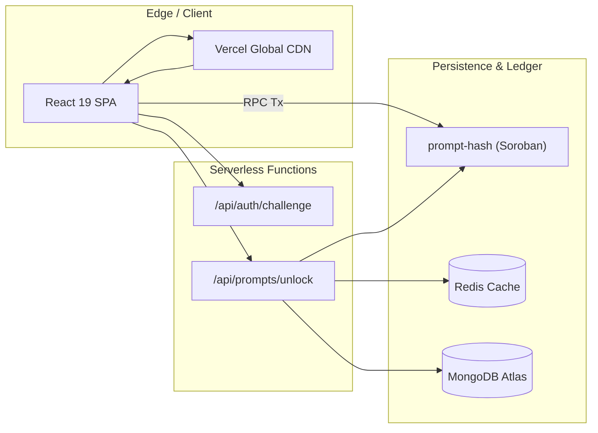
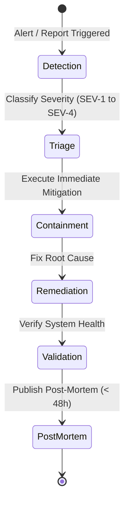

# On-Call Deployment Runbook

## 1. System Architecture & Component Inventory

PromptMint consists of the following deployment targets:

| Component                | Technology                    | Hosting / Platform        | Key Dependencies                          |
| :----------------------- | :---------------------------- | :------------------------ | :---------------------------------------- |
| **Frontend Web App**     | React 19, Vite, Tailwind CSS  | Vercel (Edge CDN)         | Browser Web Crypto, Stellar Wallets Kit   |
| **Unlock & Auth API**    | Serverless Functions (`api/`) | Vercel Serverless         | Node.js, `libsodium`, Soroban RPC         |
| **Smart Contract**       | Soroban Rust WASM             | Stellar Testnet / Mainnet | Stellar Asset Contract (Native XLM)       |
| **Read Cache**           | Redis 7+ / Upstash            | Cloud Redis / VPC         | In-memory cache for listings & stats      |
| **Metadata & Analytics** | MongoDB 6+                    | MongoDB Atlas             | Audit logs, creator profiles, indexing    |
| **Node Infrastructure**  | Soroban RPC & Horizon         | Stellar SDF / QuickNode   | Ledger ingestion & transaction submission |



---

## 2. Step-by-Step Deployment Procedure

### 2.1 Pre-Deployment Verification Checklist

Before initiating any deployment to staging or production:

- [ ] All automated tests pass (`cargo test -p prompt-hash`, `yarn test:frontend`, `yarn typecheck`, `yarn lint`).
- [ ] Working branch is rebased on latest `main` with a clean git status.
- [ ] Required environment variables are configured in Vercel and CI/CD secret manager.
- [ ] On-call engineer and release manager are identified.
- [ ] Contract state looks healthy: `yarn inspect:contract config --network testnet`

### 2.2 Smart Contract Deployment via Stellar CLI

1. **Build and Optimize Contract WASM**:

   ```bash
   # Build contract crate in release mode
   stellar contract build

   # Optimize the WASM binary for minimal footprint and gas efficiency
   stellar contract optimize \
     --wasm target/wasm32v1-none/release/prompt_hash.wasm
   ```

2. **Install WASM onto Ledger**:

   ```bash
   WASM_HASH=$(stellar contract install \
     --wasm target/wasm32v1-none/release/prompt_hash.optimized.wasm \
     --source DEPLOYER_SECRET \
     --network testnet)
   echo "Installed WASM Hash: $WASM_HASH"
   ```

3. **Deploy Contract Instance**:

   ```bash
   CONTRACT_ID=$(stellar contract deploy \
     --wasm-hash "$WASM_HASH" \
     --source DEPLOYER_SECRET \
     --network testnet)
   echo "Deployed Contract ID: $CONTRACT_ID"
   ```

4. **Initialize Contract Parameters**:
   ```bash
   stellar contract invoke \
     --id "$CONTRACT_ID" \
     --source ADMIN_SECRET \
     --network testnet \
     -- \
     initialize \
     --admin "$ADMIN_ADDRESS" \
     --fee_percentage 250 \
     --fee_wallet "$FEE_TREASURY_ADDRESS" \
     --xlm_address "$XLM_SAC_CONTRACT_ADDRESS"
   ```

### 2.3 Frontend & API Deployment on Vercel

1. **Staging / Preview Release**:

   ```bash
   # Deploy preview build with scoped environment variables
   vercel --build-env VITE_PROMPT_HASH_CONTRACT_ID="$CONTRACT_ID" \
          --build-env VITE_STELLAR_NETWORK="testnet"
   ```

2. **Execute Smoke Tests against Preview URL**:
   - Connect Freighter wallet.
   - Test prompt creation with encryption.
   - Execute test purchase and verify unlock payload.

3. **Promote to Production**:

   ```bash
   vercel --prod
   ```

4. **Warm Cache & Prime Endpoints**:
   ```bash
   curl -I https://promptmint.io/api/health
   curl -I https://promptmint.io/
   ```

---

## 3. Rollback Procedures

### 3.1 Frontend & API Instant Rollback

Vercel supports atomic instant rollbacks without rebuilding. Prefer the automated path first:

1. On a failed production deploy, `.github/workflows/auto-rollback.yml` selects the last READY production deployment with a different SHA, rolls it back, notifies Slack/Discord, and opens a GitHub incident issue. See [Automated rollback](./auto-rollback.md).
2. If automation did not run, identify the previous stable deployment ID:
   ```bash
   vercel list prompt-mint --prod
   ```
3. Instantly promote the previous stable deployment:
   ```bash
   vercel rollback <PREVIOUS_DEPLOYMENT_ID>
   ```
4. Purge edge cache across CDN nodes.

### 3.2 Smart Contract Rollback & Emergency Freeze

1. **Immediate Emergency Freeze (`pause`)**:
   If an exploit, arithmetic bug, or unexpected loss-of-funds scenario is detected:

   ```bash
   stellar contract invoke \
     --id "$CONTRACT_ID" \
     --source ADMIN_SECRET \
     --network testnet \
     -- pause
   ```

   _Impact_: Halts all `create_prompt`, `buy_prompt`, and financial state changes while preserving read access.

2. **WASM Downgrade via Two-Step Upgrade**:
   To rollback contract logic to a known stable WASM hash:
   ```bash
   # 1. Propose rollback WASM hash
   stellar contract invoke \
     --id "$CONTRACT_ID" \
     --source ADMIN_SECRET \
     -- \
     propose_upgrade \
     --new_wasm_hash "$PREVIOUS_STABLE_WASM_HASH"

   # 2. Wait for cooldown elapsed, then confirm:
   stellar contract invoke \
     --id "$CONTRACT_ID" \
     --source ADMIN_SECRET \
     -- confirm_upgrade
   ```

---

## 4. Common Failure Modes & Triage Playbooks

### Failure Mode 1: Soroban RPC Downtime or HTTP 429 Rate Limits

- **Symptoms**: `FetchError: RPC connection timeout` or HTTP 429 status in browser console.
- **Triage Steps**:
  1. Inspect primary RPC health:
     ```bash
     curl -X POST https://soroban-testnet.stellar.org:443 \
       -H "Content-Type: application/json" \
       -d '{"jsonrpc":"2.0","id":1,"method":"getHealth"}'
     ```
  2. Switch client configuration to backup RPC endpoints (e.g. QuickNode, NowNodes, Blockdaemon).
  3. Adjust frontend exponential backoff multiplier in `src/lib/stellar/sorobanClient.ts`.

### Failure Mode 2: Unlock Service Signature Verification Failures

- **Symptoms**: Buyer purchases successfully, but `/api/prompts/unlock` returns `401 Invalid wallet signature`.
- **Triage Steps**:
  1. Verify clock synchronization (NTP drift on serverless instance).
  2. Check challenge token TTL (default is 300 seconds).
  3. Ensure the wallet signing the challenge matches the exact address stored in the on-chain `Purchase` record.

### Failure Mode 3: Redis Connection Pool Exhaustion

- **Symptoms**: Listing browse latency spikes; `Error: Connection pool full`.
- **Triage Steps**:
  1. Check open client connections on Redis Dashboard.
  2. Restart stale serverless connection pool.
  3. Fall back gracefully to direct contract reads (the app handles Redis downtime without crashing).

### Failure Mode 4: Indexer Ledger Lag

- **Symptoms**: Recent purchases do not immediately appear in "My Library".
- **Triage Steps**:
  1. Run indexer reconciliation check:
     ```bash
     npm run check:setup
     ```
  2. Resync missed ledgers using `scripts/load/generate-unlock-fixtures.mjs`.

### Failure Mode 5: Deploy Provenance Badge Is Red

- **Symptoms**: The **Deploy provenance** badge in the README is red, or the `Verify deployment provenance` step failed in `deploy.yml`. No GitHub Release was published for the commit.
- **Triage Steps**:
  1. Open the failed run. If `cosign verify-blob` failed, check that the signing job ran on `refs/heads/main` from `deploy.yml`. A fork, a renamed workflow, or a missing `id-token: write` permission changes the certificate identity.
  2. If `deploy-manifest.mjs verify` reports a `mismatch`, an artifact changed between signing and release. Treat this as a possible supply-chain incident (SEV-2 or higher) and do not re-run blindly.
  3. If the report shows `missing`, check the `upload-artifact` paths in the `sign-artifacts` job.
  4. Do not promote the frontend or run `scripts/upgrade.sh` with Wasm from an unverified run. See [Deploy Manifest](../deploy-manifest.md) and [Artifact Verification](../artifact-verification.md#verified-deployment-provenance-badge).

### Failure Mode 6: Contract State Inspection Required

- **Symptoms**: Unexpected purchase failures, wrong fee displayed in UI, paused state in prod after a deploy, or post-deploy validation needed.
- **Triage Steps**:
  1. Dump platform config in one command:
     ```bash
     yarn inspect:contract config --network testnet
     ```
  2. Check a specific prompt's current price and price history:
     ```bash
     yarn inspect:contract price-history --prompt-id <id> --network testnet
     ```
  3. Check for a pending (uncommitted) contract upgrade:
     ```bash
     yarn inspect:contract upgrade --network testnet
     ```
  4. Take a full state snapshot for incident archiving:
     ```bash
     yarn inspect:contract full --json > snapshot-$(date +%s).json
     ```
  See `scripts/inspect-contract.ts` for all available commands (`config`, `prompts`, `prompt`, `price-history`, `stake`, `upgrade`, `schema`, `full`) and flags (`--network`, `--contract`, `--source`, `--json`).

---

## 5. State & Database Migration Execution

### 5.1 On-Chain Schema Version Migration (`migrate`)

When a contract upgrade alters data structures:

1. Verify new WASM is confirmed via `confirm_upgrade`.
2. Execute migration transaction as admin:
   ```bash
   stellar contract invoke \
     --id "$CONTRACT_ID" \
     --source ADMIN_SECRET \
     -- \
     migrate \
     --new_version 2
   ```
3. Inspect `SchemaMigrated` event emission to verify state upgrade.

### 5.2 MongoDB Index Migration

Execute database index creation scripts during low-traffic maintenance windows:

```javascript
db.audit_logs.createIndex({ timestamp: -1 });
db.creator_profiles.createIndex({ walletAddress: 1 }, { unique: true });
db.purchases.createIndex({ promptId: 1, buyerAddress: 1 }, { unique: true });
```

---

## 6. Environment Variable Management

| Variable Name                  | Exposure         | Required In   | Purpose                                            |
| :----------------------------- | :--------------- | :------------ | :------------------------------------------------- |
| `VITE_PROMPT_HASH_CONTRACT_ID` | Public (Client)  | Vercel Client | Deployed Soroban contract address.                 |
| `VITE_STELLAR_NETWORK`         | Public (Client)  | Vercel Client | `testnet` or `mainnet`.                            |
| `VITE_SOROBAN_RPC_URL`         | Public (Client)  | Vercel Client | RPC endpoint for ledger reads and simulations.     |
| `UNLOCK_SERVICE_PRIVATE_KEY`   | Secret (Backend) | Serverless    | Ed25519 / AES private key for unwrap & decrypt.    |
| `UNLOCK_SERVICE_PUBLIC_KEY`    | Public (Client)  | Vercel Client | Public key used by browser to wrap AES keys.       |
| `CHALLENGE_JWT_SECRET`         | Secret (Backend) | Serverless    | Cryptographic secret for signing challenge nonces. |
| `REDIS_URL`                    | Secret (Backend) | Serverless    | Connection string for Redis cache cluster.         |
| `MONGODB_URI`                  | Secret (Backend) | Serverless    | Connection string for MongoDB Atlas.               |

### 6.1 Zero-Downtime Secret Rotation Runbook

To rotate `CHALLENGE_JWT_SECRET` or `UNLOCK_SERVICE_PRIVATE_KEY`:

1. Configure dual-verification support in `api/auth/challenge.ts` accepting both Old and New keys.
2. Update Vercel environment variables with the New Key.
3. Deploy new serverless build.
4. Wait 15 minutes for all active challenge tokens signed with Old Key to expire.
5. Remove Old Key from configuration.

---

## 7. Incident Response Protocol



### 7.1 Severity Classification Matrix

| Level     | Severity     | Definition                                                                   | Target Response Time | Escalation Path                                    |
| :-------- | :----------- | :--------------------------------------------------------------------------- | :------------------- | :------------------------------------------------- |
| **SEV-1** | **Critical** | Funds at risk, contract exploit, unlock service totally down for all users.  | **< 15 minutes**     | PagerDuty On-Call + Lead Architect + Security Team |
| **SEV-2** | **Major**    | Primary purchase flow degraded, RPC latency > 5s, 50% of users affected.     | **< 30 minutes**     | On-Call Engineer + DevOps Lead                     |
| **SEV-3** | **Moderate** | Search / filter cache miss, non-critical UI glitches, partial analytics lag. | **< 2 hours**        | Engineering Team Ticket                            |
| **SEV-4** | **Minor**    | Minor cosmetic styling, documentation inaccuracies, non-blocking warning.    | **< 24 hours**       | Backlog grooming                                   |

### 7.2 On-Call Escalation & Contact Checklist

- **Primary On-Call Engineer**: Consult active PagerDuty schedule.
- **Secondary / Backup**: Engineering Lead.
- **Communications Lead**: Product Manager (for external status updates).

### 7.3 Blameless Post-Mortem Template

Every SEV-1 and SEV-2 incident requires a post-mortem document within 48 hours containing:

1. **Incident Summary**: Exact duration, user impact, and severity level.
2. **Timeline**: UTC timeline of events from detection to mitigation.
3. **Root Cause Analysis (5 Whys)**: Deep-dive into technical and process triggers.
4. **Corrective & Preventative Actions**: Action items with assigned owners and deadlines.
